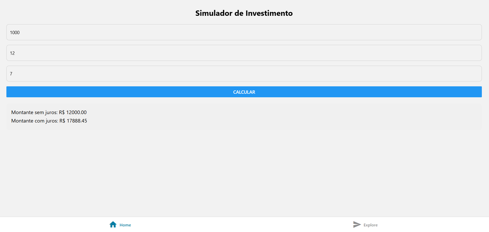

# Investimento



# 💰 Simulador de Investimento

Este aplicativo calcula o montante acumulado ao investir mensalmente um valor durante um período de tempo, com ou sem a aplicação de juros compostos. É uma alternativa ao financiamento, ajudando o usuário a entender o poder dos investimentos com paciência e planejamento.

---

## 📱 Funcionalidades

- Entrada do valor mensal a ser investido
- Definição do número de meses
- Inserção da taxa de juros mensal
- Cálculo do montante acumulado:
  - 💸 **Sem juros**
  - 📈 **Com juros compostos**
- Interface simples e intuitiva

---

## 📸 Exemplo de uso

> Simulando um investimento mensal de **R$ 500** durante **12 meses** com **1% de juros ao mês**:

- **Montante sem juros:** R$ 6.000,00  
- **Montante com juros compostos:** R$ 6.802,38

---

## 🚀 Tecnologias utilizadas

- [React Native](https://reactnative.dev/)
- [Expo](https://expo.dev/)
- TypeScript

---

## 📦 Como executar o projeto

### Pré-requisitos

- Node.js e npm instalados
- Expo CLI instalado:
  ```bash
  npm install -g expo-cli
